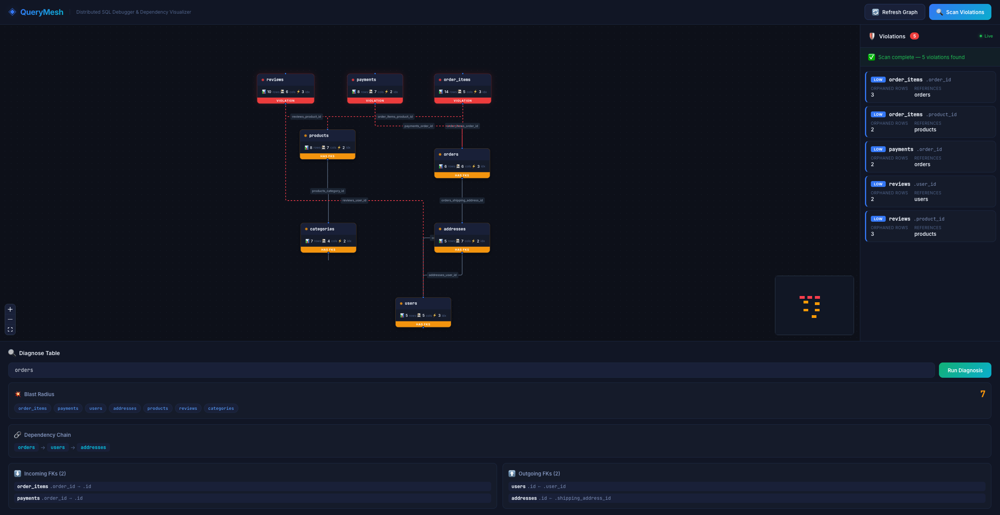
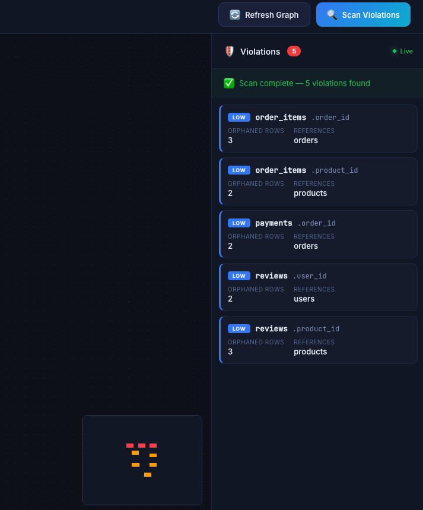
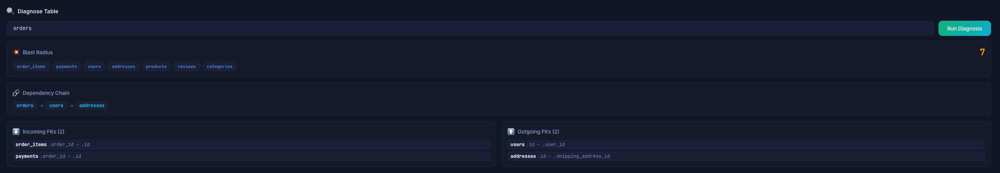
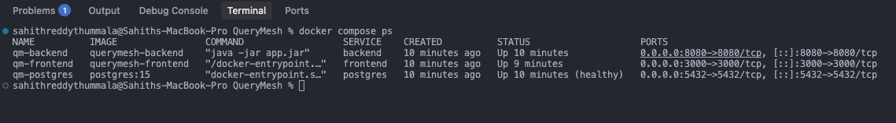

# 🌑 QueryMesh — Distributed SQL Debugger

<div align="center">
  
  
  
  
  
</div>

<br />

**A full-stack distributed SQL debugger and dependency visualizer for PostgreSQL databases.**

QueryMesh connects to a PostgreSQL database, introspects its schema using `information_schema`, automatically builds a visual foreign key dependency graph, and scans for referential integrity violations in real time. Engineers can diagnose any table to see its full dependency chain and calculate the "blast radius" — the number of tables impacted by a potential schema change.

This project was built to solve a real problem I encountered while working with multi-service databases: tracing foreign key chains across tables to understand which services and data would break when proposing schema modifications. Instead of manually querying `information_schema` and mentally mapping relationships, QueryMesh does this automatically and presents it as an interactive graph.

---

## Table of Contents

- [Screenshots](#screenshots)
- [Features](#features)
- [Architecture](#architecture)
- [Tech Stack](#tech-stack)
- [Project Structure](#project-structure)
- [Getting Started](#getting-started)
- [How It Works](#how-it-works)
- [API Reference](#api-reference)
- [WebSocket Events](#websocket-events)
- [Database Schema (Demo)](#database-schema-demo)
- [Docker Deployment](#docker-deployment)

---

## Screenshots

### 1. Dashboard — Full Dependency Graph
<!-- Place your image at: screenshots/1-dashboard.png -->

*The main dashboard displaying an interactive foreign key dependency graph. Each node represents a database table with metadata (row count, column count, index count). Edges represent FK constraints.*

### 2. Violation Scanner — Real-Time Results
<!-- Place your image at: screenshots/2-scanner.png -->

*The violation panel after completing a scan. The progress bar fills in real time as each table is scanned via WebSocket events. Each violation card shows the table name, column, orphaned row count, severity badge, and the referenced table.*

### 3. Blast Radius Diagnosis
<!-- Place your image at: screenshots/3-diagnosis.png -->

*The diagnosis panel for the `orders` table. The blast radius of 7 means that modifying the `orders` table could impact 7 other tables. The dependency chain shows the outgoing FK path: orders references users, which references addresses.*

### 4. Docker Deployment — Terminal Output
<!-- Place your image at: screenshots/4-terminal.png -->

*All three services running successfully via Docker Compose: PostgreSQL 15 (healthy), Spring Boot backend on port 8080, and the React frontend served via nginx on port 3000.*

---

## Features

### Interactive Dependency Graph
- Queries PostgreSQL `information_schema` to extract all tables, columns, foreign keys, indexes, and row counts
- Builds a graph model (nodes = tables, edges = FK constraints) and renders it using React Flow
- Automatic hierarchical layout using the dagre graph algorithm — no manual positioning needed
- Custom table nodes displaying row count, column count, index count, and a health status badge
- Edges are labeled with constraint names and animate when the source table has violations
- Includes a minimap for large schema navigation and zoom/pan controls

### Real-Time Violation Scanner
- Scans every foreign key relationship for orphaned rows (rows referencing non-existent parent records)
- Runs asynchronously on a background thread to avoid blocking the REST API
- Streams scan progress and violation alerts to the frontend via WebSocket (STOMP protocol)
- Assigns severity levels based on orphaned row count: LOW (1-9), MEDIUM (10-99), HIGH (100+)
- Each violation includes a suggested SQL fix to clean up orphaned data
- Frontend displays a live progress bar with a shimmer animation as tables are scanned

### Blast Radius Diagnosis
- Uses Breadth-First Search (BFS) to traverse the dependency graph from any starting table
- Calculates how many tables would be affected by a schema change to the target table
- Shows the full dependency chain (which parent tables this table depends on)
- Lists all incoming FKs (tables that reference this table) and outgoing FKs (tables this table references)
- Displays affected tables as visual tag chips for quick scanning

### One-Command Docker Deployment
- Multi-stage Dockerfiles for both backend (Maven build, JRE runtime) and frontend (npm build, nginx serve)
- Docker Compose orchestrates PostgreSQL, backend, and frontend with proper health checks and startup ordering
- Nginx reverse proxy handles API and WebSocket forwarding so the frontend container handles all routing
- Seeded demo database with a realistic e-commerce schema containing intentional FK violations

---

## Architecture

```
+-------------------+       REST API (JSON)       +--------------------+       JDBC / SQL       +-------------------+
|                   | ---------------------------> |                    | ---------------------> |                   |
|   React Frontend  |       GET /api/schema/*      |   Spring Boot      |   information_schema   |   PostgreSQL 15   |
|   (TypeScript)    | <--------------------------- |   Backend (Java)   | <--------------------- |                   |
|                   |       JSON responses         |                    |   FK constraints,      |   8 tables        |
|   - React Flow    |                              |   - Introspection  |   table metadata,      |   10 FK rels      |
|   - dagre layout  |       /topic/scan-progress   |     Service        |   index info           |   Seeded data     |
|   - STOMP client  | <=========================== |   - Violation      |                        |   + violations    |
|                   |       WebSocket (STOMP)       |     Scanner        |                        |                   |
|   Port 5173 (dev) |       /topic/violations      |   - Diagnostic     |                        |   Port 5432       |
|   Port 3000 (prod)|                              |     Service        |                        |                   |
+-------------------+                              +--------------------+                        +-------------------+
```

**Data flow:**

1. On page load, the frontend calls `GET /api/schema/graph`. The backend queries PostgreSQL's `information_schema.table_constraints`, `information_schema.key_column_usage`, `information_schema.constraint_column_usage`, and `information_schema.columns` to build the full graph model.

2. The frontend receives the graph JSON (nodes + edges) and passes it to React Flow with dagre auto-layout for rendering.

3. When the user clicks "Scan Violations", the frontend sends `POST /api/scan/start`. The backend starts an asynchronous scan on a background thread, iterating through each FK relationship and running a LEFT JOIN query to detect orphaned rows. As it scans, it emits `ScanProgressEvent` to `/topic/scan-progress` and `ViolationAlert` to `/topic/violations` via the STOMP message broker.

4. When the user enters a table name and clicks "Run Diagnosis", the frontend sends `POST /api/schema/diagnose`. The backend uses BFS to traverse the dependency graph from that table, calculating the blast radius and collecting all affected tables.

---

## Tech Stack

| Layer | Technology | Version | Purpose |
|-------|-----------|---------|---------|
| Frontend Framework | React + TypeScript | React 19, TS 5.7 | Component-based UI with type safety |
| Build Tool | Vite | 8.0 | Fast HMR development server and production builds |
| Graph Visualization | React Flow (@xyflow/react) | Latest | Interactive node-based graph rendering |
| Graph Layout | dagre | Latest | Automatic hierarchical graph layout algorithm |
| HTTP Client | Axios | Latest | REST API communication |
| WebSocket Client | @stomp/stompjs | Latest | STOMP protocol over WebSocket |
| Backend Framework | Spring Boot | 3.2.5 | REST API, WebSocket, dependency injection |
| Language | Java | 17+ | Backend application language |
| ORM / Data Access | Spring Data JPA + JDBC | 3.2.5 | Database queries via JdbcTemplate |
| WebSocket Server | Spring WebSocket | 6.1.6 | STOMP message broker with SockJS fallback |
| Database | PostgreSQL | 15 | Relational database with FK introspection |
| Containerization | Docker + Docker Compose | Latest | Multi-service orchestration |
| Web Server | nginx | Alpine | Production frontend serving + reverse proxy |
| Styling | Vanilla CSS | - | Custom dark-mode design system |
| Typography | Inter + JetBrains Mono | Google Fonts | UI text and monospace code/data display |

---

## Project Structure

```
QueryMesh/
|-- backend/                                      # Spring Boot application
|   |-- pom.xml                                   # Maven dependencies and build config
|   |-- Dockerfile                                # Multi-stage build: Maven -> JRE
|   |-- mvnw, mvnw.cmd                            # Maven wrapper (no local Maven needed)
|   +-- src/main/
|       |-- resources/
|       |   +-- application.yml                   # DB connection, server port config
|       +-- java/com/querymesh/
|           |-- QueryMeshApplication.java         # Entry point with @EnableAsync
|           |-- config/
|           |   |-- CorsConfig.java               # CORS for localhost:5173, :3000
|           |   +-- WebSocketConfig.java          # STOMP endpoints: /ws, /ws-sockjs
|           |-- controller/
|           |   |-- SchemaController.java         # REST: /api/schema/* (4 endpoints)
|           |   +-- ScanController.java           # REST: /api/scan/start
|           |-- model/
|           |   |-- SchemaNode.java               # Table: name, columns, indexes, rowCount
|           |   |-- SchemaEdge.java               # FK edge: from -> to with columns
|           |   |-- SchemaGraph.java              # Graph container: nodes + edges + counts
|           |   |-- ViolationResult.java          # Violation: table, orphans, severity, fix
|           |   |-- DiagnoseResult.java           # Diagnosis: chain, blastRadius, affected
|           |   |-- DiagnoseRequest.java          # Request body: { tableName }
|           |   |-- ScanProgressEvent.java        # WS event: progress during scan
|           |   +-- ViolationAlert.java           # WS event: violation detected
|           +-- service/
|               |-- SchemaIntrospectionService.java   # Queries information_schema
|               |-- ViolationScannerService.java      # Orphan detection + async WS events
|               +-- DiagnosticService.java            # BFS dependency chain + blast radius
|
|-- frontend/                                     # React + TypeScript application
|   |-- package.json                              # npm dependencies
|   |-- Dockerfile                                # Multi-stage build: npm -> nginx
|   |-- nginx.conf                                # Reverse proxy config for /api and /ws
|   |-- index.html                                # Entry HTML with global polyfill
|   |-- vite.config.ts                            # Vite build configuration
|   +-- src/
|       |-- main.tsx                              # React DOM entry point
|       |-- App.tsx                               # Main component: state, WS, API wiring
|       |-- index.css                             # Complete dark-mode design system
|       |-- types/
|       |   +-- index.ts                          # TypeScript interfaces for all models
|       |-- services/
|       |   |-- api.ts                            # Axios client for REST endpoints
|       |   +-- websocket.ts                      # STOMP client for real-time events
|       +-- components/
|           |-- Header.tsx                        # App header with action buttons
|           |-- DependencyGraph.tsx               # React Flow graph with dagre layout
|           |-- TableNode.tsx                     # Custom node: table card with stats
|           |-- ViolationPanel.tsx                # Right panel: live violations feed
|           +-- DiagnosePanel.tsx                 # Bottom panel: blast radius diagnosis
|
|-- seed.sql                                      # E-commerce schema + violations
|-- docker-compose.yml                            # PostgreSQL + backend + frontend
|-- .gitignore
+-- README.md
```

---

## Getting Started

### Prerequisites

- **Java 17+** (JDK) — for the Spring Boot backend
- **Node.js 18+** and npm — for the React frontend
- **Docker** — for PostgreSQL (and optionally for full-stack deployment)

### Option 1: Docker Compose (Quickest)

This starts everything — database, backend, and frontend — in one command:

```bash
git clone https://github.com/Sahith59/QueryMesh.git
cd QueryMesh
docker compose up --build
```

Wait about 2 minutes for the initial build, then open [http://localhost:3000](http://localhost:3000).

### Option 2: Development Mode (For Active Development)

**Terminal 1 — Start PostgreSQL with seed data:**

```bash
cd QueryMesh

docker run -d --name qm-postgres \
  -p 5432:5432 \
  -e POSTGRES_DB=querymesh_demo \
  -e POSTGRES_USER=postgres \
  -e POSTGRES_PASSWORD=demo \
  -v $(pwd)/seed.sql:/docker-entrypoint-initdb.d/seed.sql \
  postgres:15
```

Wait 5 seconds for initialization, then verify:

```bash
docker exec qm-postgres psql -U postgres -d querymesh_demo \
  -c "SELECT table_name FROM information_schema.tables WHERE table_schema = 'public' ORDER BY table_name;"
```

Expected output: addresses, categories, order_items, orders, payments, products, reviews, users.

**Terminal 2 — Start the backend:**

```bash
cd QueryMesh/backend
./mvnw spring-boot:run
```

Wait for `Started QueryMeshApplication in X seconds` in the logs.

**Terminal 3 — Start the frontend:**

```bash
cd QueryMesh/frontend
npm install
npm run dev
```

Open [http://localhost:5173](http://localhost:5173).

---

## How It Works

### Schema Introspection

The `SchemaIntrospectionService` queries PostgreSQL's internal catalog tables to extract:

- **Tables**: from `information_schema.tables` filtered by `table_schema = 'public'`
- **Columns**: from `information_schema.columns` grouped by table
- **Foreign keys**: by joining `information_schema.table_constraints`, `key_column_usage`, and `constraint_column_usage` where `constraint_type = 'FOREIGN KEY'`
- **Indexes**: from `pg_indexes` where schema is public
- **Row counts**: via `SELECT COUNT(*)` on each table

This data is assembled into a `SchemaGraph` containing `SchemaNode` objects (one per table) and `SchemaEdge` objects (one per FK constraint).

### Violation Detection

The `ViolationScannerService` iterates through every FK relationship in the schema. For each one, it runs:

```sql
SELECT COUNT(*) FROM child_table c
LEFT JOIN parent_table p ON c.fk_column = p.pk_column
WHERE p.pk_column IS NULL AND c.fk_column IS NOT NULL
```

If the count is greater than zero, orphaned rows exist — data in the child table references a parent record that no longer exists. The service assigns a severity level:

| Orphaned Rows | Severity |
|--------------|----------|
| 1 - 9 | LOW |
| 10 - 99 | MEDIUM |
| 100+ | HIGH |

Each violation includes a generated SQL statement to delete the orphaned rows.

### WebSocket Streaming

When a scan is triggered via `POST /api/scan/start`, the scanner runs on a background thread (`@Async`). As it processes each table:

1. It emits a `ScanProgressEvent` to `/topic/scan-progress` containing the current table name, tables scanned so far, total tables, violations found, and status (SCANNING/COMPLETE/ERROR).

2. When a violation is found, it immediately emits a `ViolationAlert` to `/topic/violations` with the full violation details.

3. A 300ms delay is inserted between tables so the progress bar is visible on the frontend.

The frontend connects via STOMP over WebSocket and subscribes to both topics on mount.

### Blast Radius Calculation

The `DiagnosticService` uses Breadth-First Search starting from the target table:

1. **Dependency chain**: follows outgoing FKs to find all parent tables (the tables this one depends on).
2. **Blast radius**: follows both incoming and outgoing FKs recursively to find every table that would be affected by a schema change. The blast radius number is the count of unique reachable tables.
3. **FK breakdown**: separates foreign keys into incoming (tables that reference the target) and outgoing (tables the target references).

For example, diagnosing the `orders` table in the demo schema returns a blast radius of 7, meaning a change to `orders` could cascade to 7 other tables in the schema.

---

## API Reference

### GET /api/schema/graph

Returns the full dependency graph with all tables and FK relationships.

**Response:**
```json
{
  "nodes": [
    {
      "tableName": "orders",
      "schema": "public",
      "columns": ["id", "user_id", "shipping_address_id", "status", "total_amount", "created_at"],
      "indexes": ["orders_pkey", "idx_orders_user_id", "idx_orders_status"],
      "rowCount": 6
    }
  ],
  "edges": [
    {
      "from": "orders",
      "to": "users",
      "fromColumn": "user_id",
      "toColumn": "id",
      "constraintName": "orders_user_id_fkey"
    }
  ],
  "totalTables": 8,
  "totalRelationships": 10
}
```

### GET /api/schema/tables

Returns all public tables with their columns, indexes, and row counts.

### GET /api/schema/violations

Returns all FK integrity violations detected across the schema.

**Response:**
```json
[
  {
    "tableName": "order_items",
    "columnName": "order_id",
    "referencedTable": "orders",
    "referencedColumn": "id",
    "constraintName": "order_items_order_id_fkey",
    "orphanedRows": 3,
    "severity": "LOW",
    "suggestedFix": "DELETE FROM order_items WHERE order_id NOT IN (SELECT id FROM orders) AND order_id IS NOT NULL;"
  }
]
```

### POST /api/schema/diagnose

Diagnoses a table's position in the dependency graph.

**Request body:** `{ "tableName": "orders" }`

**Response:**
```json
{
  "tableName": "orders",
  "dependencyChain": ["orders", "users", "addresses"],
  "incomingForeignKeys": [
    { "from": "order_items", "to": "orders", "fromColumn": "order_id", "toColumn": "id", "constraintName": "order_items_order_id_fkey" },
    { "from": "payments", "to": "orders", "fromColumn": "order_id", "toColumn": "id", "constraintName": "payments_order_id_fkey" }
  ],
  "outgoingForeignKeys": [
    { "from": "orders", "to": "users", "fromColumn": "user_id", "toColumn": "id", "constraintName": "orders_user_id_fkey" },
    { "from": "orders", "to": "addresses", "fromColumn": "shipping_address_id", "toColumn": "id", "constraintName": "orders_shipping_address_id_fkey" }
  ],
  "blastRadius": 7,
  "affectedTables": ["order_items", "payments", "users", "addresses", "products", "reviews", "categories"]
}
```

### POST /api/scan/start

Triggers an asynchronous violation scan. Results are streamed via WebSocket.

**Response:** `{ "status": "STARTED", "message": "Subscribe to /topic/scan-progress and /topic/violations for real-time updates" }`

---

## WebSocket Events

The application uses STOMP over WebSocket for real-time communication. The WebSocket endpoint is `ws://localhost:8080/ws`.

### /topic/scan-progress

Emitted after each table is scanned.

```json
{
  "currentTable": "order_items",
  "tablesScanned": 3,
  "totalTables": 8,
  "violationsFound": 2,
  "status": "SCANNING"
}
```

Status values: `SCANNING`, `COMPLETE`, `ERROR`

### /topic/violations

Emitted immediately when a violation is detected during scanning.

```json
{
  "table": "order_items",
  "column": "order_id",
  "orphanedRows": 3,
  "severity": "LOW",
  "suggestedFix": "DELETE FROM order_items WHERE order_id NOT IN (SELECT id FROM orders) AND order_id IS NOT NULL;",
  "referencedTable": "orders",
  "constraintName": "order_items_order_id_fkey"
}
```

---

## Database Schema (Demo)

The seed database creates a realistic e-commerce schema with 8 tables:

```
users (5 rows)
  +-- addresses (5 rows)          -- users.id <- addresses.user_id
  +-- orders (6 rows)             -- users.id <- orders.user_id
  |     +-- order_items (14 rows) -- orders.id <- order_items.order_id
  |     +-- payments (8 rows)     -- orders.id <- payments.order_id
  +-- reviews (10 rows)           -- users.id <- reviews.user_id

categories (7 rows)
  +-- products (8 rows)           -- categories.id <- products.category_id
        +-- order_items           -- products.id <- order_items.product_id
        +-- reviews               -- products.id <- reviews.product_id

orders
  +-- addresses                   -- addresses.id <- orders.shipping_address_id
```

**Intentional violations** seeded for demonstration (FK triggers temporarily disabled during insertion):

| Table | Column | Orphaned Rows | What is Wrong |
|-------|--------|--------------|---------------|
| order_items | order_id | 3 | References order IDs 997, 998, 999 which do not exist |
| order_items | product_id | 2 | References product IDs 500, 501 which do not exist |
| reviews | user_id | 2 | References user IDs 50, 51 which do not exist |
| reviews | product_id | 3 | References product IDs 100, 101, 102 which do not exist |
| payments | order_id | 2 | References order IDs 888, 889 which do not exist |

---

## Docker Deployment

### Services

| Service | Image | Port | Role |
|---------|-------|------|------|
| postgres | postgres:15 | 5432 | Database with seed data volume-mounted |
| backend | Custom (Maven + JRE) | 8080 | Spring Boot REST API + WebSocket |
| frontend | Custom (Node + nginx) | 3000 | React app served via nginx reverse proxy |

### Build Details

**Backend Dockerfile** — Multi-stage build:
- Stage 1: `maven:3.9-eclipse-temurin-17` builds the JAR with `mvn package`
- Stage 2: `eclipse-temurin:17-jre` runs the JAR (smaller runtime image)

**Frontend Dockerfile** — Multi-stage build:
- Stage 1: `node:20-alpine` runs `npm ci && npm run build` to produce static files
- Stage 2: `nginx:alpine` serves the built files with a custom `nginx.conf`

**nginx.conf** handles:
- Serving the React SPA from `/` with HTML5 history fallback (`try_files`)
- Proxying `/api/*` requests to the backend container
- Upgrading `/ws` connections to WebSocket protocol for STOMP communication

### Health Checks

PostgreSQL has a health check (`pg_isready`) that must pass before the backend starts. The backend must be running before the frontend starts. This ordering is enforced via `depends_on` with `condition: service_healthy` in `docker-compose.yml`.

---

## License

MIT
